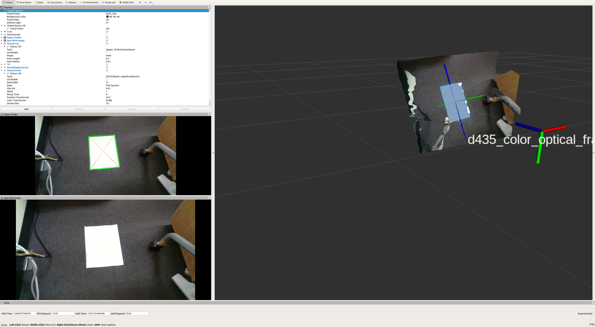

# paper_finder



  Detect papers (rectangle) and publish posearray.

## Subscribing Topic

- `~input` (`sensor_msgs/Image`)

  Input image. 

- `~input/depth` (`sensor_msgs/Image`)

  Input depth image. Subscribed if `~with_depth` is `true`.

- `~input/camera_info` (`sensor_msgs/CameraInfo`)

  Camera info. Subscribed if `~with_depth` is `true`.

## Publishing Topics

- `~output/viz` (`sensor_msgs/Image`)

  Visualization of recognition result in image.

- `~output/pose` (`geometry_msgs/PoseArray`)

  Recognized paper pose.

## Parameters

- `~angle_tolerance` (float default: `286.4788975654116`)

286.4788975654116 = np.rad2deg(5.0)

- `~area_tolerance` (float default: `0.1`)

- `~rect_x` (float default: `0.210`)

0.210 [m] is the width of A4 paper.

- `~rect_y` (float default: `0.297`)

0.297 [m] is the hight of A4 paper.

- `~length_tolerance` (float default: `0.04`)

- `~queue_size` (int default: `10`)

- `~with_depth` (bool default: `true`)

  If true, use the depth of the detected square apex position for pose estimation.

- `~approximate_sync` (bool default: `true`)

  If true, approximately synchronize inputs. Required if `~with_depth:=true`.

- `~slop` (float default: `0.1`)

  The slop time in second for `message_filters.ApproximateTimeSynchronizer`. Required if `~with_depth:=true` and `~approximate_sync:=true`.

## Sample

```
roslaunch jsk_perception sample_paper_finder.launch 
```
